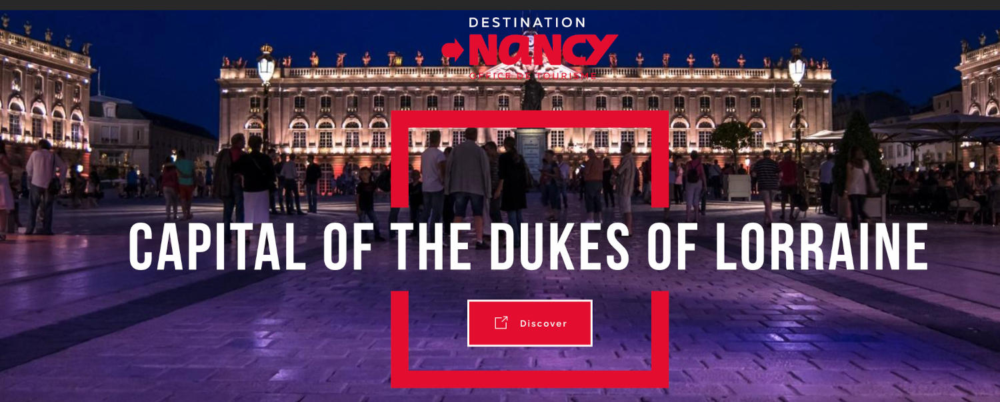

```{r setup, include=FALSE}
knitr::opts_chunk$set(echo = FALSE)
```


## Nancy

Lorraine is a region renowned for many good things: on top of its exceptional natural sites, Lorraine is also an economic and tourist hub, with several sites listed as UNESCO World Heritage Sites. As a region of festivals, culinary delights and innovation, Lorraine has many surprises in store for you.

Lorraine is also firmly committed to the 21st century.
Indeed, it has successfully diversified to become a key player in innovation and know-how. In 2019, Metz and Nancy were granted the «French Tech» label.

In addition to its vibrant cities and fast and modern public transport, the region has a proud reputation for sport, with the home of leading football, handball.Lorraine is a region where it is good to live, study,... and have fun!

A region at the crossroads of Europe, next to Luxembourg, Belgium and Germany.
Located at the heart of the Greater Region, you’ll be able to travel to Belgium, Luxembourg and Germany easily. Within one hour and a half from Paris by TGV, you’ll have the opportunity to pay a visit to the French capital.Our cities quickly give way to peaceful and beautiful rural landscapes. Between nature and historical heritage, Lorraine is the ideal place to live in.

- A traditional center for science, technology and culture.
- Capital of the Dukes of Lorraine
- The cradle of Art Nouveau. 
- The worldwide known Place Stanislas, UNESCO monument and “the most beautiful French monument in 2021”
- French gastronomy and local specialties

```{r, layout="l-body", fig.cap="More information: https://www.nancy-tourisme.fr/en/ ", out.extra="class=external"}

```

## Getting to Nancy

To consult all the transportation options consult the following information from the Tourism Office:
[Transportation to Nancy](https://www.nancy-tourisme.fr/en/prepare-your-stay/access-and-transport/getting-to-nancy/)


## Accomodation

The conference organizers have negotiated a special rate at some hotels for ICE-IAMOT attendees that is applicable from the WE before and up to the WE after the conference.

Participants have to use reservation platform on this link: 
[Reservation platform](http://event.nancy-tourisme.fr/event/registration?eventid=176&langue=UK)
